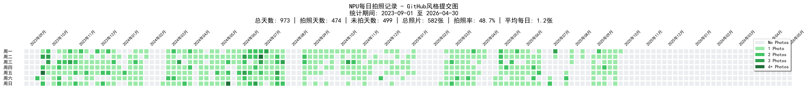

# 📊 NPU拍照统计工具集

这个目录包含了用于分析NPU每日拍照数据的各种统计工具，支持多种可视化方式和输出格式。

## 📁 文件说明

### 📊 五大统计工具功能对比

#### `statistics.py_m` - 单目录统计工具
**功能**：统计单个目录的拍照情况
- 🔧 支持用户输入任意目录路径
- 🗓️ 自动从文件夹名提取年月信息（如2023.10）
- 🔄 交互式循环模式，输入'q'退出
- 📊 快速查看单个月份的拍照统计

#### `statistics_y.py` - 全量统计工具
**功能**：对2023.09.01-2026.04.30期间的所有照片进行全面统计
- 📅 支持多种显示模式（年度/月度/每日）
- 🔍 自动验证日期处理（闰年、月份天数）
- 📊 详细的统计汇总信息
- 💻 纯文本输出，适合命令行查看

#### `visual_commit.py` - 命令行版提交图
**功能**：在命令行中显示GitHub风格统计图
- 💻 适合终端环境使用
- 📊 多种显示模式选择
- 🎨 类似GitHub的绿色方块提交图
- ⚡ 快速预览拍照活跃度

#### `visual_commit_markdown.py` - **主推工具** ⭐
**功能**：生成GitHub风格的commit图表，输出为Markdown格式报告
- 📊 GitHub风格的拍照提交图（垂直7行布局）
- 📈 年度和月度统计表格
- 📄 完整的Markdown报告
- 🎨 可视化拍照模式和趋势
- 📝 适合文档分享和存档

**输出文件**：`NPU_Photo_Statistics_Report.md`

#### `visual_commit_png.py` - **主推工具** ⭐
**功能**：生成GitHub风格的commit图表，输出为PNG图片格式
- 🖼️ 高质量PNG图片输出（300 DPI）
- 📊 真实GitHub风格的绿色方块可视化
- 🎨 支持中文字体显示和图例
- 📏 横向展开显示，不受文本宽度限制
- 🔧 可自定义颜色、大小和样式
- 💾 适合插入PPT、报告或网页

**输出文件**：`NPU_Photo_Commit_Chart.png`


### 🛠️ 辅助工具
#### `check_date.py` - 日期验证工具
**功能**：验证特定日期是星期几
- 🗓️ 用于验证统计起始日期的正确性

## 📸 数据源格式

### 支持的文件格式
- **文件名格式**：`IMG_YYYYMMDD_HHMMSS.jpg`
- **示例**：`IMG_20230901_114129.jpg`

### 目录结构
```
NPU-Everyday/
├── 2023.09/
│   ├── IMG_20230901_114129.jpg
│   ├── IMG_20230902_103045.jpg
│   └── ...
├── 2023.10/
│   ├── IMG_20231001_090235.jpg
│   └── ...
└── ...
```

## 🎨 可视化效果

### GitHub风格提交图示例
```
       周一 周二 周三 周四 周五 周六 周日
     ────────────────────────────────
23.09 │ ❌  ❌  ❌  ❌  ✅  ✅  ❌ 
23.09 │ ✅  ✅  ❌  ✅  ✅  ✅  ✅ 
23.10 │ ✅  ❌  ✅  ✅  ✅  ✅  ✅ 
```

### 图例说明
- ✅ 有拍照
- ❌ 未拍照  
- ⬜ 统计范围外

## 📊 统计指标

### 基础统计
- **总天数**：统计期间内的总天数
- **拍照天数**：有照片的天数
- **未拍天数**：没有照片的天数
- **总照片数**：所有照片的总数量
- **拍照率**：拍照天数占总天数的百分比
- **平均每拍照日**：平均每个拍照日的照片数量

### 时间维度统计
- **年度统计**：按年汇总，包含闰年标识
- **月度统计**：按月详细统计
- **每日统计**：具体到每一天的拍照情况

## 🔧 自定义配置

### 修改统计范围
在相应的Python文件中找到以下代码段进行修改：
```python
# 定义统计日期范围
start_date = datetime(2023, 9, 1)
end_date = datetime(2026, 4, 30)
```

### 修改数据源路径
```python
base_directory = r"你的NPU-Everyday目录路径"
```

