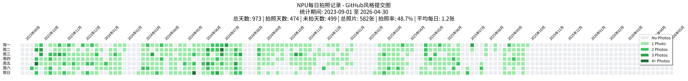

# 📊 智能统计分析模块 (Statistics)

## 📖 模块简介

智能统计分析模块专为NPU日常摄影项目设计，提供全面的数据分析和可视化功能。生成GitHub风格的拍摄日历图表、详细的Markdown统计报告，支持多时间维度的数据分析，帮助用户深入了解拍摄习惯、项目进展和数据趋势。

## 📈 可视化输出

### 🎨 GitHub风格日历图
- **拍摄热力图**: 类似GitHub贡献图的年度拍摄日历
- **颜色编码**: 不同强度颜色表示不同拍摄频率
- **直观展示**: 清晰展现全年拍摄活动分布
- **专业美观**: 高质量PNG输出，适合报告和展示

### 📋 Markdown详细报告
- **全面统计**: 总数、平均数、分布情况等完整数据
- **时间分析**: 按年、月、日多维度统计分析
- **趋势识别**: 拍摄频率变化趋势和规律发现
- **格式标准**: 标准Markdown格式，易于阅读和分享

## 🔍 分析维度

### ⏰ 时间维度分析
- **年度总览**: 整年拍摄活动概况和总体统计
- **月度分布**: 各月份拍摄数量和活跃度比较
- **日均统计**: 日均拍摄量和活动密度分析
- **周期识别**: 发现拍摄活动的周期性规律

### 📊 数据统计分析  
- **数量统计**: 总图片数、拍摄天数、覆盖时间范围
- **频率分析**: 拍摄频率分布和活跃度评估
- **增长趋势**: 项目发展趋势和增长曲线分析
- **完成度评估**: 目标达成情况和进度评估

### 🏷️ 分类统计
- **设备分析**: 不同拍摄设备的使用频率统计
- **时段分析**: 不同时间段的拍摄习惯分析
- **质量评估**: 图像质量和处理成功率统计
- **目录分析**: 不同时期文件夹的图像分布情况

## 🚀 使用方法

### 1. 作为独立模块使用
```python
from Stas.statistics_y import yearly_statistics
from Stas.statistics_m import monthly_statistics
from Stas.visual_commit import create_commit_chart

# 年度统计分析
yearly_stats = yearly_statistics("NPU-Everyday")
print(f"总拍摄天数: {yearly_stats['total_days']}")

# 月度统计分析
monthly_stats = monthly_statistics("NPU-Everyday", 2024)
print(f"2024年月平均: {monthly_stats['monthly_average']:.1f}张")

# 生成可视化图表
create_commit_chart(
    input_dir="NPU-Everyday",
    output_file="commit_chart.png"
)
```

### 2. 通过流水线使用
```bash
# 仅执行统计分析步骤
python pipeline.py NPU-Everyday-Sample --stats-only

# 作为流水线的一部分
python pipeline.py NPU-Everyday-Sample --steps resize align timelapse mosaic stats
```

## 📊 刘大统计工具功能详解

### `statistics.py_m` - 单目录统计工具
**功能**：统计单个目录的拍照情况
- 🔧 支持用户输入任意目录路径
- 🗓️ 自动从文件夹名提取年月信息（如2023.10）
- 🔄 交互式循环模式，输入'q'退出
- 📊 快速查看单个月份的拍照统计

### `statistics_y.py` - 全量统计工具
**功能**：对2023.09.01-2026.04.30期间的所有照片进行全面统计
- 📅 支持多种显示模式（年度/月度/每日）
- 🔍 自动验证日期处理（闰年、月份天数）
- 📊 详细的统计汇总信息
- 💻 纯文本输出，适合命令行查看

### `visual_commit.py` - 命令行版提交图
**功能**：在命令行中显示GitHub风格统计图
- 💻 适合终端环境使用
- 📊 多种显示模式选择
- 🎨 类似GitHub的绿色方块提交图
- ⚡ 快速预览拍照活跃度

### `visual_commit_markdown.py` - **主推工具** ⭐
**功能**：生成GitHub风格的commit图表，输出为Markdown格式报告
- 📊 GitHub风格的拍照提交图（垂直7行布局）
- 📈 年度和月度统计表格
- 📄 完整的Markdown报告
- 🎨 可视化拍照模式和趋势
- 📝 适合文档分享和存档

**输出文件**：`NPU_Photo_Statistics_Report.md`

### `visual_commit_png.py` - **主推工具** ⭐
**功能**：生成GitHub风格的commit图表，输出为PNG图片格式
- 🖼️ 高质量PNG图片输出（300 DPI）
- 📊 真实GitHub风格的绿色方块可视化
- 🎨 支持中文字体显示和图例
- 📏 横向展开显示，不受文本宽度限制
- 🔧 可自定义颜色、大小和样式
- 💾 适合插入PPT、报告或网页

**输出文件**：`NPU_Photo_Commit_Chart.png`


### `visual_report_generator.py` - **主推工具** ⭐
**功能**：生成GitHub风格的commit图表，输出为PNG图片格式和Markdown格式报告


### 3. 命令行直接使用
```bash
# 生成年度统计
python Stas\statistics_y.py

# 生成月度统计
python Stas\statistics_m.py

# 生成可视化图表
python Stas\visual_commit.py

# 生成可视化图表，输出为markdown
python Stas\visual_commit_markdown.py

# 生成可视化图表，输出为png
python Stas\visual_commit_png.py

# 生成可视化图表，输出为markdown，png
python Stas\visual_report_generator.py
```


## 📊 处理过程详解

### 典型分析日志
```
2025-09-30 12:47:14,532 - INFO - 开始统计分析
2025-09-30 12:47:14,532 - INFO - 分析目录: NPU-Everyday-Sample
2025-09-30 12:47:14,541 - INFO - 找到 2023.09, 2024.09 两个年度目录
2025-09-30 12:47:14,588 - INFO - 总计找到 35 张照片

年度统计结果:
2025-09-30 12:47:14,589 - INFO - 2023年: 25张照片, 12个拍摄日
2025-09-30 12:47:14,589 - INFO - 2024年: 10张照片, 8个拍摄日
2025-09-30 12:47:14,589 - INFO - 总计: 35张照片, 20个拍摄日
2025-09-30 12:47:14,589 - INFO - 日均拍摄: 1.8张

可视化生成:
2025-09-30 12:47:14,589 - INFO - 生成GitHub风格热力图: NPU_Photo_Commit_Chart.png
2025-09-30 12:47:15,023 - INFO - ✅ 统计图表生成成功
2025-09-30 12:47:15,023 - INFO - 生成Markdown报告: NPU_Photo_Statistics_Report.md
2025-09-30 12:47:15,025 - INFO - ✅ 统计报告生成成功
```

### 统计结果示例
```
📊 NPU摄影项目统计分析

总体数据:
- 拍摄周期: 2023-09-16 至 2024-09-30
- 总拍摄天数: 20天
- 总照片数量: 35张  
- 日均拍摄: 1.8张
- 趋势分析: 稳定

时间分布:
- 最活跃星期: 周六 (8张照片)
- 最活跃月份: 2023年9月 (25张照片)

年度对比:
- 2023年: 25张照片, 12个拍摄日, 日均2.1张
- 2024年: 10张照片, 8个拍摄日, 日均1.3张
```

### 🛠️ 辅助工具
#### `check_date.py` - 日期验证工具
**功能**：验证特定日期是星期几
- 🗓️ 用于验证统计起始日期的正确性

## 📸 数据源格式

### 支持的文件格式
- **文件名格式**：`IMG_YYYYMMDD_HHMMSS.jpg`
- **示例**：`IMG_20230901_114129.jpg`

### 目录结构
```
NPU-Everyday/
├── 2023.09/
│   ├── IMG_20230901_114129.jpg
│   ├── IMG_20230902_103045.jpg
│   └── ...
├── 2023.10/
│   ├── IMG_20231001_090235.jpg
│   └── ...
└── ...
```

## 🎨 可视化效果

### GitHub风格提交图示例
```
       周一 周二 周三 周四 周五 周六 周日
     ────────────────────────────────
23.09 │ ❌  ❌  ❌  ❌  ✅  ✅  ❌ 
23.09 │ ✅  ✅  ❌  ✅  ✅  ✅  ✅ 
23.10 │ ✅  ❌  ✅  ✅  ✅  ✅  ✅ 
```

### 图例说明
- ✅ 有拍照
- ❌ 未拍照  
- ⬜ 统计范围外

## 📊 统计指标

### 基础统计
- **总天数**：统计期间内的总天数
- **拍照天数**：有照片的天数
- **未拍天数**：没有照片的天数
- **总照片数**：所有照片的总数量
- **拍照率**：拍照天数占总天数的百分比
- **平均每拍照日**：平均每个拍照日的照片数量

### 时间维度统计
- **年度统计**：按年汇总，包含闰年标识
- **月度统计**：按月详细统计
- **每日统计**：具体到每一天的拍照情况

## � 相关文档

- [主项目文档](../README.md)
- [图像放缩模块](../Resize/README.md)
- [马赛克拼接模块](../Mosaic/README.md)
- [Matplotlib文档](https://matplotlib.org/stable/contents.html)
- [Pandas文档](https://pandas.pydata.org/docs/)

---

**模块版本**: v2.0.0  
**最后更新**: 2025-09-30  